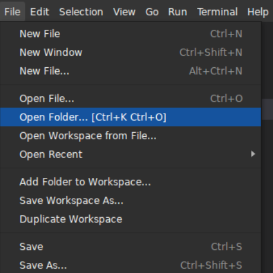
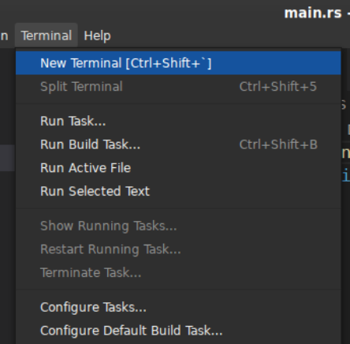

# Quick, to the IDE!

Let's start using that nice VS Code that we installed earlier. 

Open VS Code, look for the Menu `File` and click `Open Folder...`. 



Select the `learnrust` folder that cargo created.

> NOTE: For myself, I find more convenient to open VSCode from the terminal.  
> I simply `cd learnrust` and run `code .`. VSCode will open the folder.

Now, open the src folder using the left panel, and you'll see the `main.rs`. 
Double-click on it.

This is what you should see:
```rust
fn main() {
   println!("Hello, world!");
}
```

`fn main()` represents the main program. 

The brackets next to it (`{` and `}`) define where the program starts and ends. 

Right now there's only one line in the program: `println!(...)`

`println!(...)` is for printing text on the console/terminal.

The text between the parentheses is what will be printed. 
Notice that it's surrounded by double quotes and these are 
not printed to the terminal. They're required.

This line ends with a semicolon `;` this is what marks the end of the 
instruction (the command to run). 
Rust does not care about the different lines, or how they look in your editor. 
You can put all in one line and still will do the same thing. 
VSCode will format by default when you save, so it will always look nice and tidy.
<!-- user might need to enable format on save; also other configs to tune would be helpful like auto save -->

Open a new terminal inside VS Code. Go to `Terminal` ⇒ `New Terminal`:
  


This opens a terminal on the project folder, so you can now type there "cargo run" to run the program inside this terminal panel.
  

As you can see we can do the same things as with an external terminal. As this is more convenient, we'll use this from now on. There's no difference to an external one, so if you prefer to have a separate terminal program running, it's totally fine.

You can try to print different texts or more lines. For example:
  

This is not very useful, but it's important to play around and get familiar with what we learn.

Programs are executed one line at a time. Rust will read the first line, execute the command, then go to the next line and do the same. Until it reaches the end of the program and then the program just ends.